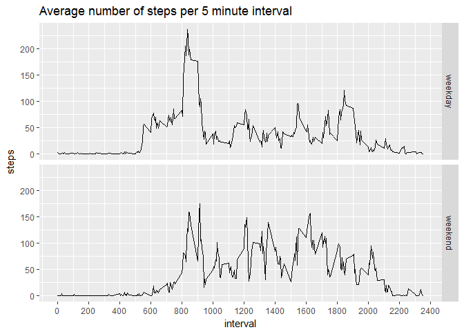

# Reproducible Research: Peer Assessment 1


## Loading and preprocessing the data

The raw data set is in the repository, thus no explicit downloading is necessary.


```r
activity <- read.csv("activity.csv", stringsAsFactors = FALSE)
activity$date <- as.Date(activity$date, format = "%Y-%m-%d")
summary(activity)
```

```
##      steps             date               interval     
##  Min.   :  0.00   Min.   :2012-10-01   Min.   :   0.0  
##  1st Qu.:  0.00   1st Qu.:2012-10-16   1st Qu.: 588.8  
##  Median :  0.00   Median :2012-10-31   Median :1177.5  
##  Mean   : 37.38   Mean   :2012-10-31   Mean   :1177.5  
##  3rd Qu.: 12.00   3rd Qu.:2012-11-15   3rd Qu.:1766.2  
##  Max.   :806.00   Max.   :2012-11-30   Max.   :2355.0  
##  NA's   :2304
```

## What is mean total number of steps taken per day?


```r
days <- aggregate(formula = steps ~ date,
                  data = activity,
                  FUN = sum)
str(days)
```

```
## 'data.frame':	53 obs. of  2 variables:
##  $ date : Date, format: "2012-10-02" "2012-10-03" ...
##  $ steps: int  126 11352 12116 13294 15420 11015 12811 9900 10304 17382 ...
```
It appears that only for 53 of 61 days the steps variable is not NA. Indeed, 8 days times 24 hours times 12 5-min-intervals equals the 2304 NAs shown in the summary in the previous section. Consequently, for all other days full data is available.


```r
summary(days$steps)
```

```
##    Min. 1st Qu.  Median    Mean 3rd Qu.    Max. 
##      41    8841   10760   10770   13290   21190
```

Median and mean number of steps taken each day are almost equal: 10760 and 10770, respectively. The following plot shows the distribution of steps on a day.


```r
library(ggplot2)
with(days, 
     qplot(steps, 
           geom="histogram",
           binwidth = 1250, # sd(steps)/length(steps)^(1/3),
           ylab = "days",
           main = "Histogram of steps on a day")
     + scale_y_continuous(breaks = seq(0, 12, by = 2))
     )
```

<!-- -->

## What is the average daily activity pattern?


```r
intervals <- aggregate(formula = steps ~ interval,
                       data = activity,
                       FUN = mean)
with(intervals,
     qplot(interval,
           steps,
           geom = "line",
           main = "Average number of steps per 5 minute interval")
     ) + 
    scale_x_continuous(breaks = seq(0, 2400, by = 200))
```

<!-- -->

The maximum average activity is observed in the morning, more precisely in the interval 835.

## Imputing missing values

There are 2304 missing values for the steps variable, this is about 13.1% of all observations.

As we have seen before, missing values occur for whole days. The following table shows no pattern with respect to weekdays.

```r
table(weekdays(unique(activity[is.na(activity$steps),"date"])))
```

```
## 
## Donnerstag    Freitag   Mittwoch     Montag    Samstag    Sonntag 
##          1          2          1          2          1          1
```

Since we expect different activity with respect to day of week we derive a replacement for missing values from the mean of the available values for the same 5 min interval and weekday.


```r
library(dplyr, quietly = TRUE, warn.conflicts = FALSE)
activity2 <- activity %>%
    group_by(interval, weekday = weekdays(date)) %>%
    mutate(steps.imputed = coalesce(as.double(steps), 
                                    mean(steps, na.rm = TRUE))) %>%
    ungroup() %>%
    select(steps = steps.imputed, date, interval)

days2 <- aggregate(formula = steps ~ date,
                   data = activity2,
                   FUN = sum)
summary(days2$steps)
```

```
##    Min. 1st Qu.  Median    Mean 3rd Qu.    Max. 
##      41    8918   11020   10820   12810   21190
```

Due to imputing missing values median and mean of number of steps have increased from 10760 to 11020 and from 10770 to 10820, respectively. The following histogram shows respective additional mass right of the peak at 10000 steps.


```r
with(days2, 
     qplot(steps, 
           geom="histogram",
           binwidth = 1250, # sd(steps)/length(steps)^(1/3),
           ylab = "days",
           main = "Histogram of steps on a day (imputed missing values)")
     + scale_y_continuous(breaks = seq(0, 14, by = 2))
     )
```

<!-- -->


## Are there differences in activity patterns between weekdays and weekends?


```r
activity2$daytype <- factor(as.POSIXlt(activity2$date)$wday %in% c(0, 6),
                            labels = c("weekday", "weekend"))
intervals2 <- aggregate(formula = steps ~ interval + daytype,
                        data = activity2,
                        FUN = mean)
with(intervals2,
     qplot(interval,
           steps,
           geom = "line",
           facets = daytype ~ .,
           main = "Average number of steps per 5 minute interval")
     ) + 
    scale_x_continuous(breaks = seq(0, 2400, by = 200))
```

<!-- -->

On weekends the activity (measured by average number of steps) in the morning (5:30 to 9:30) is lower on weekends than on weekdays. This seems to be compensated by a higher activity level until the evening.
